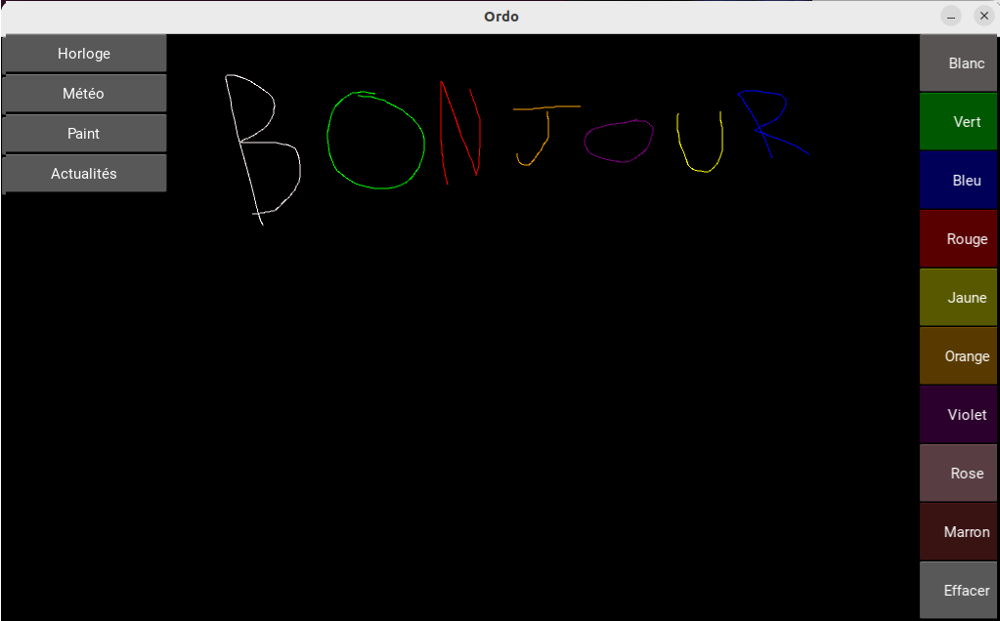

# Ordo_clock

Application Ordo permettant de dessiner avec vos doigts sur un écran tactile.



## Ajouter l'application

Sur Ordo, déposer ce dossier dans "plugins" dans votre application Ordo.

Puis, sur parameters/ordo.json, ajouter Ordo_clock de cette manière : 

```
{
    "plugins" : ["ordo_paint"]
}
```